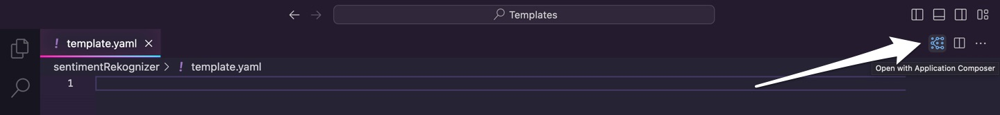
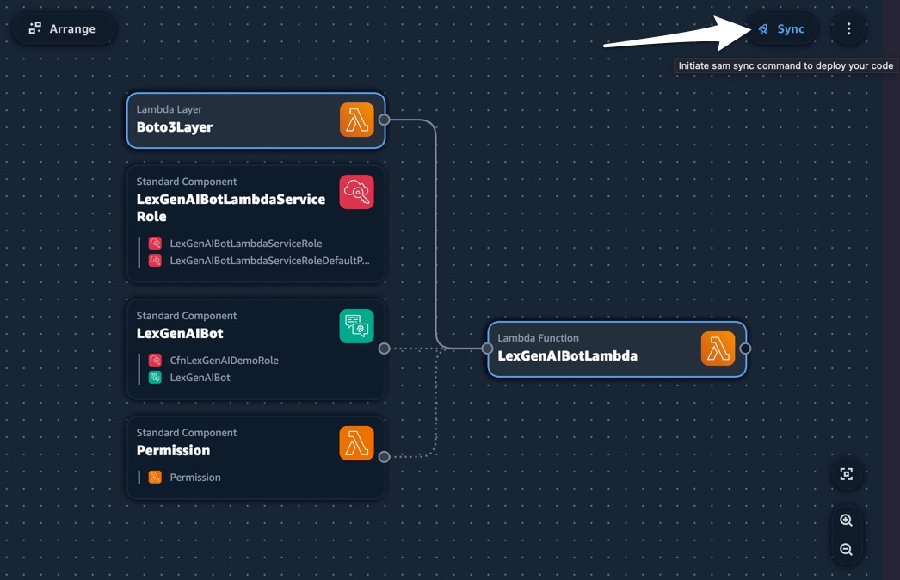

# lex-lambda-bedrock-app-composer
A clone of [lex-lambda-bedrock-cdk-python](https://github.com/awsarippa/lex-lambda-bedrock-cdk-python) using [AWS Application Composer](https://aws.amazon.com/application-composer/). The repository shows a serverless way of how to leverage GenAI capabilities to build a NextGen chatbot using AWS Application Composer and AWS SAM.


# Instructions 
***(taken from awsarippa/lex-lambda-bedrock-cdk-python and modified to use AWS SAM)***

### What resources will be created?
This CDK code will create the following:
   - 1 Lex bot
   - 1 Lambda (to invoke the Bedrock api and subsequently the Foundation Model provided by Anthropic to generate the text content)
   - 2 Iam roles (one for the lex bot to call Lambda, one for the Lambda to call Bedrock)

## Requirements

### Bedrock Access

Ensure you have sufficient access to Amazon Bedrock and the different Foundation Models provided by leading AI Foundation model providers. 
For access, follow the [documentation](https://docs.aws.amazon.com/bedrock/latest/userguide/model-access.html).

### Development Environment
**VSCode IDE*

We'll be using the [AWS Toolkit](https://marketplace.visualstudio.com/items?itemName=AmazonWebServices.aws-toolkit-vscode) extension in the VS Code IDE. You'll need a valid [Builder ID](https://docs.aws.amazon.com/signin/latest/userguide/sign-in-aws_builder_id.html) with permissions to use [CodeWhisperer](https://aws.amazon.com/codewhisperer/).

### AWS setup
**Region**

If you have not yet run `aws configure` and set a default region, you must do so, or you can also run `export AWS_DEFAULT_REGION=<your-region>`. The region used in the demonstration is us-east-1 as the Bedrock service is available only in limited regions.

**Authorization**

You must use a role that has sufficient permissions to create Iam roles, as well as cloudformation resources

#### Python >=3.8
Make sure you have [python3](https://www.python.org/downloads/) installed at a version >=3.8.x in the CDK environment. The demonstration has used python version 3.8 and a layer has been attached.
The layer used in this demonstration has Boto3>=1.28.57 (for Bedrock service).

#### AWS SAM CLI
Make sure you have the [AWS SAM CLI](https://docs.aws.amazon.com/serverless-application-model/latest/developerguide/install-sam-cli.html) locally.


## Setup

### Set up environment and gather packages

```
gh repo clone bildungsroman/lex-lambda-bedrock-app-composer
cd lex-lambda-bedrock-cdk-python
```

Install the required dependencies into your Python environment 
```
pip install -r requirements.txt
```

### View and deploy your resources with AWS Application Composer in VS Code

Open the `template.yaml` file in your root directory. If you've installed/updated the AWS Toolkit, you should see the `Open in App Composer` icon:



Click the icon, and you'll see your template loaded. If you've set up your SAM CLI, you can click the `Sync` button and be guided through the deployment process.



The deployment will create a Lex bot, a Lambda and a S3 bucket.

## Usage
Once all the resources are created after `cdk deploy` finishes, go to AWS Management Console and search for Amazon Lex service. 
If the deployment is successful, a Lex bot named `LexGenAIBot` should be seen in the Bots home page.


### Things to make sure in Lex console

- Click on Bot `LexGenAIBot` and verify that three intents `Welcome Intent`, `GenerateTextIntent`, and `FallbackIntent` are present as per the below screenshot. 


- Click on `WelcomeIntent` and scroll down to `Sample utterances` to ensure sample utterances are created. 


- Scroll down to find the `Closing response` section and expand the `Message group` dropdown. Ensure that a closing message is present. 


- If all the above steps are in place, click on `GenerateTextIntent` available on the list of Intents (seen left-hand side).


- Once you are in the `GenerateTextIntent` page, scroll down to `Sample utterances` to ensure the utterances are created.


- Scroll down to find the `Fulfilment` section and click on the `Advanced options` button. Verify that `Fulfilment Lambda code hook option` is checked.


- Once the above steps are verified, go back ot the `Intents` page and under the `Deployment section`, click on `Aliases`.


- Click on `TestBotAlias` and scroll down to `Languages` section to find the language that used in the deployment, i.e., `English (US)`. Click on `English (US)`.


- The opened page shows the Lambda function for the Bot. Ensure the source Lambda and version or alias is properly set, as per the resource created from the CDK deployment.


- Once all the above steps are verified, go back to the `LexGenAIBot` `All languages` section. Click on `Build` and you are ready to `Test` the bot post successful build.


- Bot build in progress


- Once the Bot is built successfully, we're ready to test the `LexGenAIBot` bot. Click on the `Test` button


- The Test console opens up.


- Enter some sample queries and get the image generated.


### Tips for best results

**Keep your lambda perpetually warm by provisioning an instance for the runtime lambda**

Go to Lambda console > select the function LexGenAIServerlessStack-LexGenAIBotLambda*

Versions > Publish new version

Under this version 
   - Provisioned Concurrency > set value to 1
   - Permissions > Resource based policy statements > Add Permissions > AWS Service > Other, your-policy-name, lexv2.amazonaws.com, your-lex-bot-arn, lamdba:InvokeFunction

Go to your Lex Bot (LexGenAIBot)

Aliases > your-alias > your-language > change lambda function version or alias > change to your-version

This will keep an instance running at all times and keep your lambda ready so that you won't have cold start latency. This will cost a bit extra (https://aws.amazon.com/lambda/pricing/) so use thoughtfully. 

## Clean Up

To clean up the resources created as part of this demonstration, run the command `sam delete` in the directory `lex-lambda-bedrock-app-composer`.